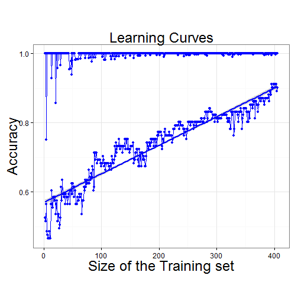

## Project description

Classification model was created to classify images - bad/good automatically. 
<br><br>
This application helps to assess model performance. It contains results of 405 models. First result is based on 2 images in training set and next results gets by incrementing number of images by 1.
<br><br>
Final model result based on 406 images in training set.


--- .class #id 

## Performance Metrics of final model


```
## Accuracy:  0.9009901
```

```
## TP:  44  FP:  4  FN:  6  TN:  47
```

```
## Precision:  0.9167  Recall:  0.88  F1 Score:  0.898
```

--- .class #id 

## Learning curves

By plotting learning curves we can assess how does the accuracy of a learning method change as a function of the training set size

 

--- .class #id 

## Summary

This plot is showing absolute difference Good and Bad probabilities. If it small them we can conclude that model not sure about whcih class should be for that image.
<br><br>
Additionally we can see which images was classified incorrectly as False Positives (FP) and False Negatives (FN)

 


